# **MFC4 Project – README**

## **Project Topic**
**An Efficient ECG Signal Denoising Technique Based on the Combination of Particle Swarm Optimisation and Wavelet Transform**

---

## **Team Members**
- **Rupesh Namburi** – CB.SC.U4AIE24234  
- **Karlapati Sreeshanth** – CB.SC.U4AIE24225  
- **Gandrothu Karthik** – CB.SC.U4AIE24217  
- **Yaramati Uday Sri** – CB.SC.U4AIE24260  

---

## **Base / Reference Paper(s)**
- **An Efficient ECG Signals Denoising Technique Based on the Combination of Particle Swarm Optimisation and Wavelet Transform**  
  *Heliyon, 2024*  
  Paper Link: https://www.cell.com/heliyon/fulltext/S2405-8440(24)02202-3
---
## Dataset

The ECG signals used in this project are taken from the **MIT-BIH Arrhythmia Database**, one of the most widely used datasets for ECG signal processing and arrhythmia detection research.

Dataset Link:  
https://physionet.org/content/mitdb/1.0.0/

The MIT-BIH Arrhythmia Database contains **48 half-hour ECG recordings collected from 47 subjects**, recorded at a sampling frequency of **360 Hz**. Each recording includes annotated heartbeats and rhythm information, making it a standard benchmark dataset for evaluating ECG signal processing algorithms. 
In this project, ECG signals from this dataset were used to evaluate the performance of the **PSO-based Wavelet Transform denoising framework**.

---
## Introduction

Electrocardiogram (ECG) signals represent the electrical activity of the heart and are essential for diagnosing cardiovascular diseases. A typical ECG waveform includes the P wave, QRS complex, and T wave, which correspond to different stages of the cardiac cycle and help clinicians detect abnormalities such as arrhythmias and myocardial infarction.

In practical environments, ECG signals are often affected by noise and artifacts that distort important signal characteristics. Therefore, effective ECG signal denoising is a critical preprocessing step to ensure reliable analysis and accurate automated diagnosis.

ECG signals are considered **NON-STATIONARY**, meaning that their statistical properties, such as frequency content and amplitude, vary over time. Because of this time-varying behavior, traditional signal processing techniques based on fixed frequency assumptions are often insufficient for effective noise removal.

To address this problem, time–frequency analysis techniques such as the Discrete Wavelet Transform (DWT) are widely used. DWT analyzes signals at multiple scales, enabling effective separation of noise from useful ECG components. However, the performance of wavelet-based denoising depends on selecting appropriate parameters such as the wavelet basis, decomposition level, and thresholding method.

In this project, we implement an ECG denoising framework that combines Wavelet Transform with Particle Swarm Optimisation (PSO). DWT decomposes the ECG signal into different frequency components, while PSO automatically optimizes the denoising parameters. This hybrid approach improves the signal-to-noise ratio (SNR) while preserving important ECG features.

### Key Concepts

- **ECG Signal Analysis** – Study of electrical activity of the heart through P wave, QRS complex, and T wave.
- **Noise Removal** – Eliminating artifacts such as power line interference and Gaussian noise.
- **Wavelet Transform (DWT)** – Decomposes signals into multiple frequency components for effective noise separation.
- **Particle Swarm Optimisation (PSO)** – Optimizes wavelet parameters to improve denoising performance.
- **Signal Reconstruction** – Rebuilds the ECG signal while preserving important morphological features.

---

## ECG Noise Reduction using Wavelet Transform (WT)

### Overview

Wavelet Transform (WT) is an effective signal processing technique used for analyzing **non-stationary signals** such as ECG signals. Unlike traditional Fourier-based methods, WT provides both **time-domain and frequency-domain analysis**, allowing efficient separation of noise from useful signal components.

Wavelet Transform can be categorized into two main types:

- **Continuous Wavelet Transform (CWT)**
- **Discrete Wavelet Transform (DWT)**

In this project, **Discrete Wavelet Transform (DWT)** is used for ECG signal denoising because of its computational efficiency and ability to perform **multi-resolution analysis**.

---

### Mathematical Representation of DWT

The Discrete Wavelet Transform is defined as:

$$
C(a,b) = \sum_{n \in Z} x(n)\, g_{j,k}(n)
$$

Where:

- $C(a,b)$ = Wavelet coefficient  
- $x(n)$ = Input ECG signal  
- $g_{j,k}(n)$ = Scaled and shifted wavelet function  
- $a = 2^{-j}$ = Scale parameter  
- $b = k2^{-j}$ = Translation parameter  
- $j, k \in Z$

The scaled wavelet function is defined as:

$$
g_{j,k}(n) = 2^{j/2} g(2^j n - k)
$$

This equation represents the **scaled and translated version of the mother wavelet**, which is used to analyze different signal frequencies.

---

### Wavelet-Based ECG Denoising Procedure

The wavelet denoising process consists of three main stages:

1. **Signal Decomposition**
2. **Thresholding**
3. **Signal Reconstruction**

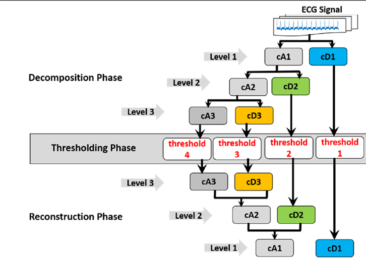

**Figure 1:** Wavelet-based ECG denoising process showing the decomposition, thresholding, and reconstruction stages.

As shown in **Figure 1**, the ECG signal is first decomposed into multiple levels using the Discrete Wavelet Transform (DWT). Each decomposition level separates the signal into approximation coefficients (cA) and detail coefficients (cD). The detail coefficients primarily contain high-frequency components where noise is dominant.

In the **thresholding phase**, threshold values are applied to the wavelet coefficients to suppress noise while preserving important signal characteristics.

Finally, in the **reconstruction phase**, the denoised signal is reconstructed using the inverse Discrete Wavelet Transform (iDWT) by combining the processed approximation and detail coefficients.

---
### 1. ECG Signal Decomposition

In the first stage of the wavelet denoising process, the ECG signal is decomposed into multiple levels using the **Discrete Wavelet Transform (DWT)**. At each decomposition level, the signal is separated into two components:

- **Approximation coefficients (cA)** – representing the low-frequency components of the ECG signal.
- **Detail coefficients (cD)** – representing the high-frequency components where most of the noise is present.

The decomposition process is performed using **low-pass and high-pass filters** followed by **downsampling**, producing a multi-resolution representation of the signal.

The approximation and detail coefficients at level *i* are defined as:

$$
cA_i(t) = \sum_{k=-\infty}^{\infty} cA_{i-1}(k)\,\phi_i(t-k)
$$

$$
cD_i(t) = \sum_{k=-\infty}^{\infty} cD_{i-1}(k)\,\psi_i(t-k)
$$

Where:

- $cA_i(t)$ represents the **approximation coefficients** at level $i$
- $cD_i(t)$ represents the **detail coefficients** at level $i$
- $\phi$ represents the **scaling function**
- $\psi$ represents the **wavelet function**

During decomposition, **only the approximation coefficients (cA)** are further decomposed into the next level, while the **detail coefficients (cD)** are directly forwarded to the **thresholding stage** for noise suppression.

This hierarchical decomposition enables efficient separation of high-frequency noise from the useful ECG signal.

---

### 2. Thresholding

Thresholding is the second stage of the wavelet denoising process. After the ECG signal is decomposed using the Discrete Wavelet Transform (DWT), thresholding is applied to the **detail coefficients**, where noise components are dominant. The goal of thresholding is to suppress noise while preserving the important features of the ECG signal.

The threshold value is estimated based on the noise level of the wavelet coefficients. In this work, the **Minimax thresholding technique** is used to determine the optimal threshold value that minimizes the maximum mean square error (MSE) between the original and denoised signals.

The threshold value $\delta$ is calculated as:

$$
\delta =
\begin{cases}
\sigma (0.3936 + 0.1829 \log_2(N)), & N > 32 \\
0, & N \le 32
\end{cases}
$$

Where:

- $\delta$ = Threshold value  
- $\sigma$ = Estimated noise standard deviation  
- $N$ = Length of the signal  

The noise standard deviation is estimated using the **Median Absolute Deviation (MAD)** method:

$$
\sigma = \frac{\text{median}(|D_{ij}|)}{0.6745}
$$

Where:

- $D_{ij}$ represents the **detail coefficients at unit scale**

The general thresholding operation applied to the noisy wavelet coefficients is expressed as:

$$
Z = THR(\hat{X}, \delta)
$$

Where:

- $THR$ represents the **thresholding function**
- $\hat{X}$ represents the **wavelet coefficient**
- $\delta$ represents the **threshold value**

---

### Hard Thresholding

Hard thresholding removes coefficients whose absolute value is smaller than the threshold.

$$
\hat{x}_{di}(l) =
\begin{cases}
\hat{x}_{di}(l), & |\hat{x}_{di}(l)| \ge \delta_l \\
0, & |\hat{x}_{di}(l)| < \delta_l
\end{cases}
$$

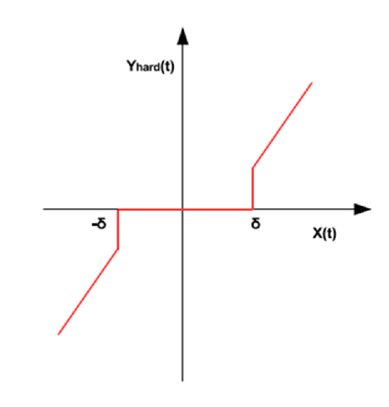

**Figure 2:** Hard thresholding function.

---

### Soft Thresholding

Soft thresholding shrinks the coefficients toward zero after thresholding, producing smoother results.

$$
\hat{x}_{di}(l) =
\begin{cases}
\hat{x}_{di}(l) - |\delta_l|, & |\hat{x}_{di}(l)| \ge \delta_l \\
0, & |\hat{x}_{di}(l)| < \delta_l
\end{cases}
$$

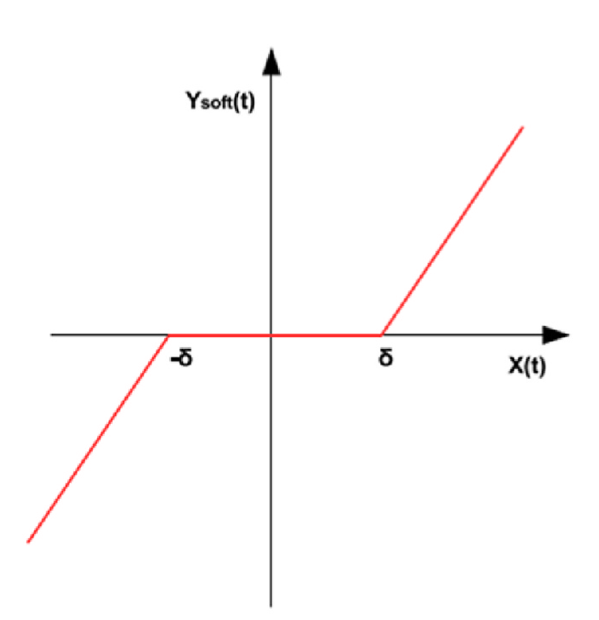

**Figure 3:** Soft thresholding function.

---

Soft thresholding generally provides smoother signal reconstruction compared to hard thresholding, making it more suitable for ECG signal denoising.

---

### 3. Signal Reconstruction

After the thresholding operation is applied to the wavelet coefficients, the final step of the denoising process is **signal reconstruction**. In this stage, the denoised ECG signal is reconstructed using the **Inverse Discrete Wavelet Transform (iDWT)**.

The reconstruction process combines the **approximation coefficients** and the **thresholded detail coefficients** from all decomposition levels to recover the time-domain ECG signal.

The reconstructed denoised ECG signal is expressed as:

$$
ECG_{denoised} =
\sum_{k=-\infty}^{\infty} cA_L(k)\phi'_i(t-k)
+
\sum_{i=1}^{L}
\sum_{k=-\infty}^{\infty} cD_{i+1}(k)\psi'_i(t-k)
$$

Where:

- $ECG_{denoised}$ represents the **reconstructed ECG signal**
- $cA_L(k)$ represents the **approximation coefficients at the final decomposition level**
- $cD_i(k)$ represents the **detail coefficients**
- $\phi'$ represents the **reconstruction scaling function**
- $\psi'$ represents the **reconstruction wavelet function**
- $L$ represents the **decomposition level**

During reconstruction, the wavelet coefficients are processed through:

- **Upsampling**
- **Low-pass and high-pass filtering**
- **Summation of reconstructed components**

This process restores the ECG signal in the **time domain while minimizing the effect of noise**, resulting in a denoised signal that preserves the important morphological features of the ECG waveform.

---

### Wavelet Denoising Parameters

Wavelet-based ECG denoising depends on selecting appropriate parameter configurations. These parameters control how the signal is decomposed, thresholded, and reconstructed. The ranges of parameters used in this work are summarized below.

#### Table 1: Parameter ranges for wavelet denoising

| Parameter | Range |
|----------|-------|
| Wavelet basis function (Φ) | Coiflet (coif1–coif5), Symlet (sym1–sym45), Daubechies (db1–db45), Fejer-Korovkin (fk4, fk8, fk14, fk18, fk22), Biorthogonal (bior1.1–bior1.5, bior2.2–bior2.8, bior3.1–bior3.9) |
| Threshold function (β) | Soft (s), Hard (h) |
| Decomposition level (L) | 1 – 10 |
| Threshold selection rule (λ) | Sqtwolog, Minimax, Heursure, Rigrsure |
| Rescaling method (ρ) | No scaling (one), Single level (sln), Multiple levels (mln) |

---

Table 2: Threshold Selection Rules

| Rule | Description |
|-----|-------------|
| Rigrsure | Threshold based on Stein’s Unbiased Risk Estimate (SURE) |
| Sqtwolog | Threshold chosen as √(2 log M) |
| Heursure | Combination of Rigrsure and Sqtwolog |
| Minimax | Threshold chosen to minimize the maximum mean square error (MSE) |

---

#### Table 3: Rescaling methods for wavelet thresholding

| Rescaling Method | Description |
|------------------|-------------|
| sln | Single level scaling |
| mln | Multiple level scaling |
| one | No scaling |

---
The parameters listed above define the possible configurations of the wavelet-based ECG denoising process. The effectiveness of the denoising method largely depends on selecting the right combination of these parameters. Choosing them manually can be difficult and time-consuming. To address this, Particle Swarm Optimisation (PSO) is used to automatically search for the optimal parameter set that improves the denoising performance.

## Particle Swarm Optimisation (PSO)

### Intuition Behind PSO

Particle Swarm Optimisation (PSO) is a population-based optimization algorithm inspired by the collective behavior of natural systems such as bird flocks or fish schools. In PSO, a group of candidate solutions called **particles** explore the search space to find the optimal solution.

Each particle represents a possible solution to the optimization problem. During the search process, particles update their positions based on their own experience and the experience of neighboring particles. Through this cooperative behavior, the swarm gradually converges toward the best solution.

The movement of each particle is influenced by two key factors:

- **Personal best (pbest):** the best solution found by the particle itself.
- **Global best (gbest):** the best solution found by the entire swarm.

By continuously updating particle positions using these two pieces of information, PSO efficiently searches for the optimal parameter configuration.

---
### PSO Representation for Wavelet Parameter Optimization

In this work, Particle Swarm Optimisation (PSO) is used to find the optimal parameters for wavelet-based ECG denoising.

Each particle in the swarm represents a **possible set of wavelet parameters** used in the denoising process.

The parameter vector of a particle is defined as:

$$
x = (\Phi, L, \beta, \lambda, \rho)
$$

Where:

- $\Phi$ – wavelet basis function  
- $L$ – decomposition level  
- $\beta$ – thresholding function (soft or hard)  
- $\lambda$ – threshold selection rule  
- $\rho$ – rescaling method  

Each particle tests a different combination of these parameters. The quality of each solution is evaluated using a **fitness function** that measures how well the ECG signal is denoised.

During the optimization process, particles update their positions and move toward better solutions. Over multiple iterations, the swarm converges to the parameter set that provides the **best denoising performance**.

Each particle explores different combinations of these parameters in the search space. The quality of each candidate solution is evaluated using a **fitness function**, which measures how effectively the denoising process improves the ECG signal quality.

Through iterative updates of particle positions and velocities, the swarm gradually converges toward the parameter configuration that produces the best denoising performance.

---
### Proposed Method Workflow

The overall workflow of the proposed ECG denoising method is illustrated in **Figure 4**.

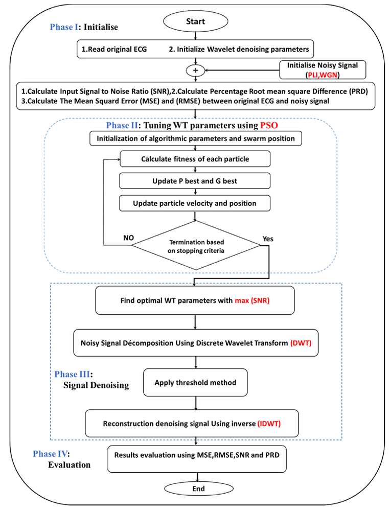

**Figure 4:** Workflow of the proposed ECG denoising framework using Wavelet Transform and Particle Swarm Optimisation.
--
### PSO Algorithm

The Particle Swarm Optimisation (PSO) algorithm is used to search for the optimal set of wavelet denoising parameters. The algorithm works by iteratively improving a population of candidate solutions called **particles**.

Each particle represents a possible combination of wavelet parameters and moves through the search space to find a better solution.

The main steps of the PSO algorithm used in this work are:

1. **Initialize the parameters**
   - Read the original ECG signal.
   - Initialize the wavelet denoising parameters.
   - Generate the noisy ECG signal.

2. **Initialize the swarm**
   - Randomly initialize particle positions and velocities.
   - Each particle represents a candidate set of wavelet parameters.

3. **Evaluate particle fitness**
   - Apply wavelet denoising using the parameters represented by the particle.
   - Compute the fitness value for each particle.

4. **Update personal best and global best**
   - Each particle stores its best solution found so far (**pbest**).
   - The best solution among all particles is stored as **gbest**.

5. **Update particle velocity and position**
   - Particle velocity and position are updated so that particles move toward better solutions.

6. **Check stopping condition**
   - If the stopping criteria is not satisfied, repeat the process.
   - Otherwise, stop the algorithm.

7. **Obtain optimal parameters**
   - The global best particle provides the optimal wavelet parameters.

Using these optimized parameters, the ECG signal is denoised using **Discrete Wavelet Transform (DWT)** and the final signal is reconstructed using **inverse DWT (iDWT)**.

---
### Mathematical Formulation of PSO

In the PSO algorithm, each particle moves in the search space by updating its **velocity** and **position** at every iteration. These updates guide the particles toward better solutions.

The velocity update equation is defined as:

$$
v_i(t+1) =
\omega v_i(t)
+
c_1 r_1 (p_i - x_i(t))
+
c_2 r_2 (g - x_i(t))
$$

Where:

- $v_i(t)$ – velocity of particle $i$ at iteration $t$
- $\omega$ – inertia weight controlling the influence of previous velocity
- $c_1$ – cognitive learning coefficient
- $c_2$ – social learning coefficient
- $r_1, r_2$ – random numbers in the range [0,1]
- $p_i$ – personal best position of particle $i$
- $g$ – global best position found by the swarm
- $x_i(t)$ – current position of particle $i$

After updating the velocity, the particle position is updated using:

$$
x_i(t+1) = x_i(t) + v_i(t+1)
$$

Where:

- $x_i(t)$ represents the current position of particle $i$
- $x_i(t+1)$ represents the updated particle position

Through these iterative updates, particles move toward the best solutions discovered by both their own experience (**pbest**) and the swarm (**gbest**).

---
### Fitness Function for Optimization

To evaluate the quality of each particle in the swarm, a **fitness function** is used. The fitness function measures how well the selected wavelet parameters improve the quality of the ECG signal after denoising.

In this work, the objective is to maximize the **Signal-to-Noise Ratio (SNR) improvement** obtained after applying the wavelet denoising process.

The SNR improvement is defined as:

$$
SNR_{imp} = SNR_{output} - SNR_{input}
$$

Where:

- $SNR_{input}$ represents the signal-to-noise ratio of the **noisy ECG signal**
- $SNR_{output}$ represents the signal-to-noise ratio of the **denoised ECG signal**

The PSO algorithm searches for the parameter combination that **maximizes the SNR improvement**, resulting in better noise suppression while preserving important ECG signal features.

During the optimization process, each particle's parameter set is applied to the wavelet denoising procedure, and the resulting SNR improvement is used as the **fitness value**.

---
## Results

This section presents the results of the proposed **PSO-based Wavelet Transform ECG denoising method** and **Wavelet Operation Analysis**. Several toy signals were first used to validate the PSO approach, followed by experiments on a real ECG signal.

---
## Wavelet Operation Analysis

To understand the computational cost of basic wavelet operations, we analyzed the execution time required for **wavelet shifting** and **wavelet scaling**. These operations form the basis of wavelet transform analysis and are important for understanding the computational behavior of the denoising process.

---

### Wavelet Shifting

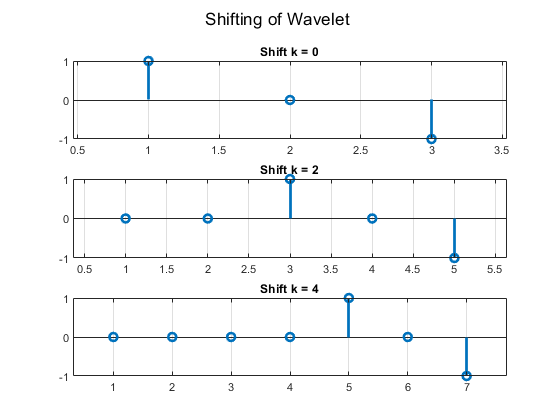

**Figure 4:** Illustration of wavelet shifting, where the wavelet function is translated along the time axis to analyze different signal locations.

Execution time: **0.185391 seconds**

---

### Wavelet Scaling

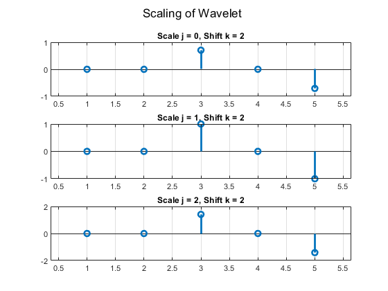

**Figure 5:** Illustration of wavelet scaling, where the wavelet function is stretched or compressed to analyze different frequency components of the signal.

Execution time: **0.106918 seconds**

---

## PSO-Based Denoising Experiments

To evaluate the performance of the proposed **Particle Swarm Optimisation (PSO) based Wavelet Transform denoising method**, experiments were conducted on several toy signals as well as a real ECG signal. The execution time for each experiment was measured using MATLAB's `tic` and `toc` commands.

---

### Toy Example 1: Single Sinusoidal Signal

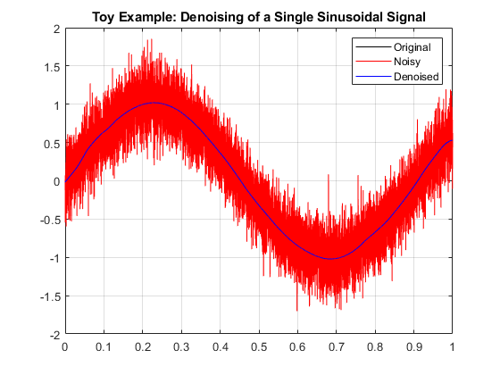

**Figure 6:** Denoising of a single sinusoidal signal corrupted with Gaussian noise using the PSO-optimized wavelet parameters.

Execution time: **1.153597 seconds**

---

### Toy Example 2: Multi-Frequency Signal

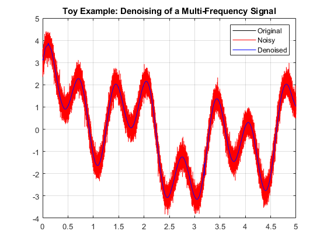

**Figure 7:** Denoising of a composite multi-frequency signal consisting of several sine and cosine components.

Execution time: **2.395561 seconds**

---

### Toy Example 3: Piecewise Signal

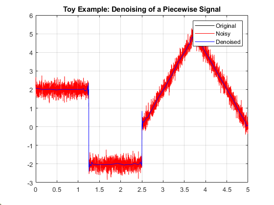

**Figure 8:** Denoising of a piecewise signal containing step and ramp segments using PSO-optimized wavelet parameters.

Execution time: **1.578835 seconds**

---
## PSO–WT ECG Denoising

The proposed PSO-based wavelet denoising framework was also applied to a real ECG signal dataset.

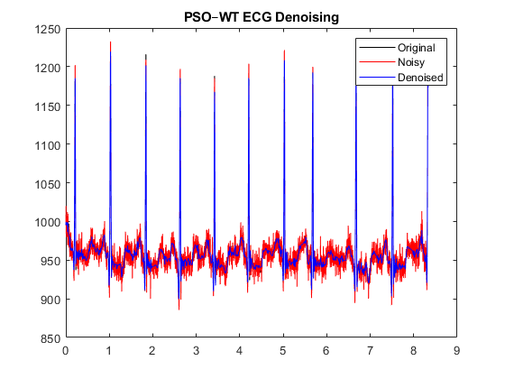

**Figure 9:** Comparison between the original ECG signal, noisy ECG signal, and the denoised ECG signal obtained using the PSO–WT method.

Execution time: **60.521735 seconds**

## Visualization of SNR Improvement

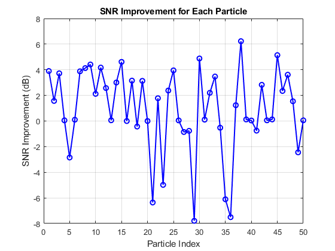

**Figure 10:** SNR improvement observation of 50 particles.

---
## Execution Details

The experiments were performed on the following platform:

| Parameter | Details |
|----------|--------|
| Platform | Laptop |
| Programming Language | MATLAB |
| Hardware | CPU |
| Timing Method | `tic` / `toc` |
